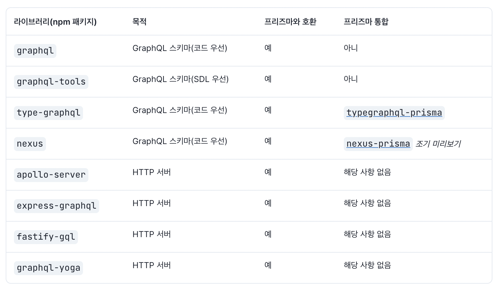

# GraphQL

GraphQL은 API용 쿼리 언어이다. RESTful API의 대안으로 자주 사용되지만 기존 RESTful 서비스 위에 추가 게이트웨이 계층으로 사용할 수도 있다.

Prisma를 사용하면 데이터베이스에 연결하는 GraphQL 서버를 구축할 수 있다. Prisma는 사용하는 GraphQL 도구와 완전히 무관하다. GraphQL 서버를 구축할 때 Prisma를 Apollo Server, express-graphql TypeGraphQl, GraphQL.js 또는 GraphQL 서버 설정에서 사용하는 거의 모든 도구나 라이브러리와 같은 도구와 결합할 수 있다.

# 내부의 GraphQL 서버

GraphQL 서버는 두 가지 주요 구성 요소로 구성된다.

- GraphQL 스키마(유형 정의 + 해석기)
- HTTP 서버

GraphQL 스키마는 코드 우선 또는 SDL 우선으로 작성할 수 있다. 

GraphQL 스키마와 HTTP 서버는 일반적으로 별도의 라이브러리에서 처리된다. 다음은 현재 GraphQL 서버도구와 그 목적에 대한 개요이다.

# 자주하는 질문

## GraphQL 서버에서 Prisma의 역할은 무엇입니까?

위의 GraphQL 도구/라이브러리 중 어느것을 사용하든 상관없이 Prisma는 GraphQL 리졸버 내부에서 데이터베이스에 연결하는 데 사용된다. 다른 ORM 또는 SQL 쿼리 빌더가 해석기 내부에서 갖는 것과 동일한 역할을 한다.

GraphQL 쿼리의 리졸버에서 Prisma는 일반적으로 데이터베이스에서 데이터를 읽어 GraphQL 응답으로 반환한다.

GraphQL 변형의 해석기에서 Prisma는 일반적으로 데이터베이스에 데이터를 쓴다. (예 : 새 레코드 생성 또는 기존 레코드 업데이트)
